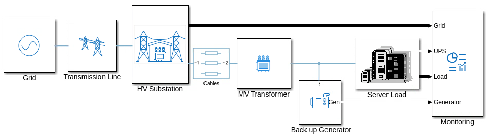
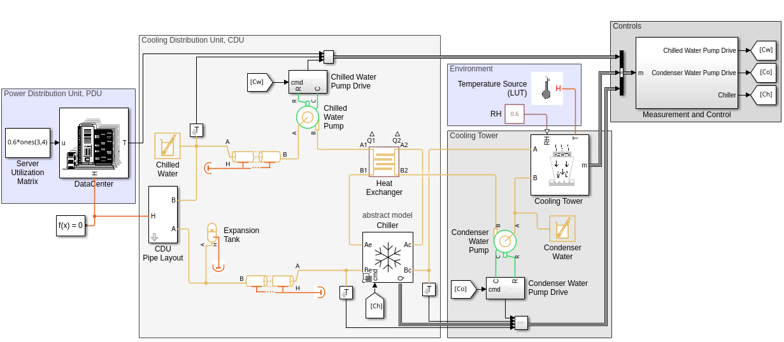
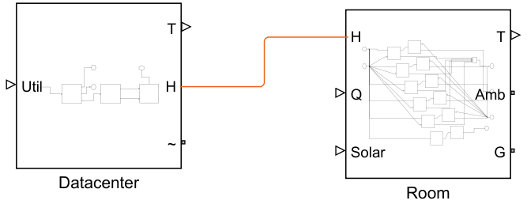
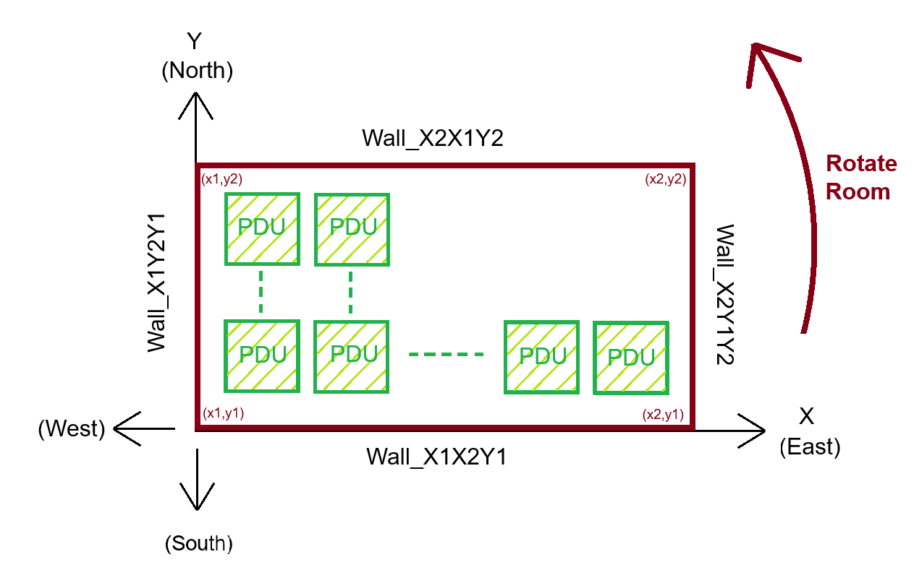

# Data Center Design with Simscape

<table>
  <tr>
    <td class="text-column" width=1200>In this project, you learn how to 
        design modern data centers by specifying server rack layouts and 
        power ratings. The project shows how to design and validate 
        double-conversion UPS control systems, including low-voltage 
        ride-through compliance, mains-loss scenarios, and N+1 redundancy 
        analysis for critical workloads.
    </td>
  </tr>
</table>

<table>
  <tr>
    <td class="image-column" width=1200></td>
  </tr>
</table>

<table>
  <tr>
    <td class="text-column" width=1200>You also learn how to estimate 
        HVAC loads based on server utilization and analyze liquid cooling 
        system power requirements for MW-scale facilities.
    </td>
  </tr>
</table>

<table>
  <tr>
    <td class="image-column" width=1200></td>
  </tr>
</table>

<table>
  <tr>
    <td class="text-column" width=1200>The project provides utility functions to 
    help create large MW-scale Data Centers (automated), starting from server 
    name-plate-ratings. You can also (optionally) add building rooms around the
    Data Center, specify glass/or and concrete walls around it, and simulate
    the impact of changing weather pattern and solar heat load.
    </td>
  </tr>
</table>

<table>
  <tr>
    <td class="image-column" width=600></td>
<td class="image-column" width=600></td>
  </tr>
</table>

## To Get Started 
* Clone the project repository.
* Open DataCenterDesignSimscape.prj to get started with the project. 
* Requires MATLAB&reg; release R2025b, Simulink&reg;, Simscape&trade;, Simscape Electrical&trade;, Simscape Fluids&trade;, and Stateflow&reg;.
 
Copyright 2025 - 2026 The MathWorks, Inc.
