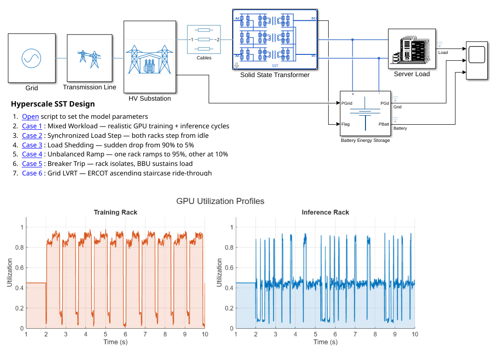
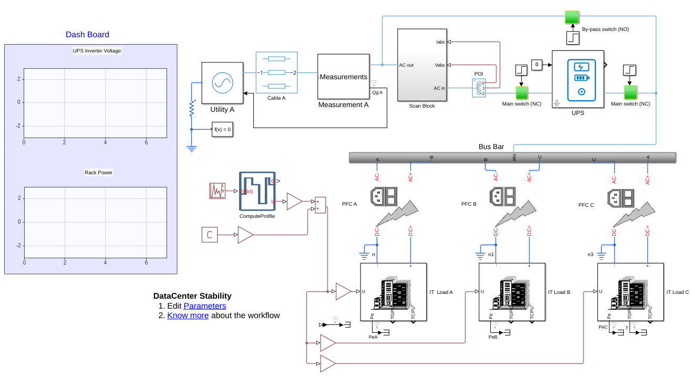
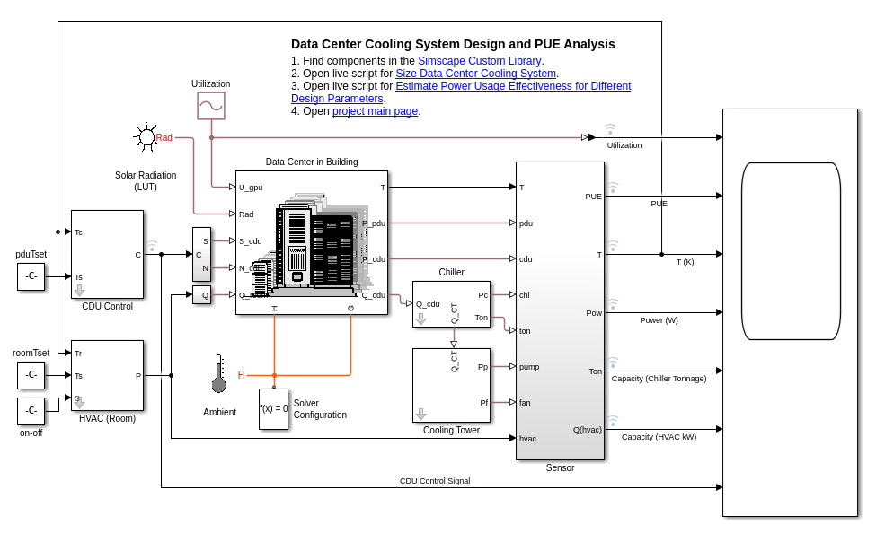
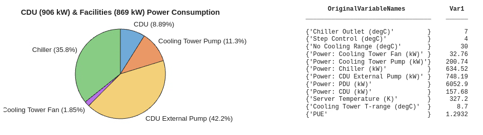

# Data Center Design with Simscape

<table>
  <tr>
    <td class="text-column" width=1200>
        In this project, you will find eight different workflows that help 
        you in designing the data centers using Simscape. You start by 
        building and parameterizing liquid-cooled or air-cooled data center 
        plant models using the composite library blocks provided in this 
        project. The composite blocks let you select between model fidelities 
        based on your application.
    </td>
  </tr>
</table>

## Electrical Analysis
<table>
  <tr>
    <td class="text-column" width=1200>
        On the electrical side, you design a double-conversion UPS validated 
        against IEC 62040-3 and ITIC, evaluate a Solid State Transformer 
        with CHB-DAB power delivery to GPU racks, and assess MW-scale 
        network stability under firmware faults, weak grids, and UPS 
        degradation.
    </td>
  </tr>
</table>

<table>
  <tr>
    <td class="image-column" width=600></td>
    <td class="image-column" width=600></td>
  </tr>
</table>

## Thermal Analysis

<table>
  <tr>
    <td class="text-column" width=600>
        On the thermal side, you size the cooling system over a full year 
        of local weather, tune control settings to achieve a low PUE, design 
        the chiller, cooling tower, and pump temperature controller, and 
        evaluate aisle and server temperatures for air-cooled layouts.
    </td>
    <td class="image-column" width=600></td>
  </tr>
</table>

<table>
  <tr>
    <td class="image-column" width=1200></td>
  </tr>
</table>

## To Get Started 
* Clone the project repository.
* Open DataCenterDesignSimscape.prj to get started with the project. 

## Requirement(s)
* MATLAB&reg; release R2025b
* Simulink&reg;
* Simscape&trade;
* Simscape Electrical&trade;
* Simscape Fluids&trade;
* Stateflow&reg;
* Control System Toolbox&trade;
* Simulink Control Design&trade;
* System Identification Toolbox&trade;

 
Copyright 2025 - 2026 The MathWorks, Inc.
